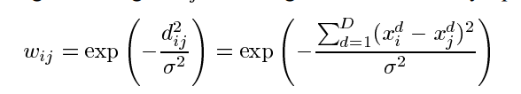
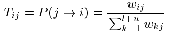

LAP（标签传递算法）

## 1. 简述

本文提出一种迭代的标签传递算法，利用没有标记的数据来帮助已经标记的数据来进行分类。另外利用基于启发式的最小生成树来和熵最小化来学习参数。

## 2. 背景

在监督学习当中，我们会有大量已经标记的数据，这样我们就可以很轻松的学习到分类的信息以及依赖的特征。但是当我们只有少量已经标记的数据，而大多数都是没有被标记的话，那么我们就没有办法像监督学习那样，比较轻易的获得分类所依赖的特征。

但是未标记数据与已标记数据之间存在某种空间分布关系，可能存在着不同类别之间会在空间中存在着某种gap，利用这种特殊的空间关系，我们可能可以比较好的划分开这些数据。最常用最简单方法应该是k-NN。

## 3. Labal Propagation(标签传递)

### 3.1 问题转化

假设：

> 1. 我们有l个已经标记的数据点，u个没有被标记的数据点，l<<u
> 2. 数据点相近具有相似的标签

创建一个全连接图，把所有的数据节点都连接起来，节点间连接的边都被赋予权重。

>其中，$d_{ij}$是节点间的欧几里得距离，然后$\sigma$是一个用来调节的参数

当然也有别的距离算法，这里对于$\sigma$允许不同的维度下面采用不同的值。

对于每一个节点，都由它的软标记，我们让标记在节点间经过边传播，当然权重越大的话，传播就越容易，传播的一个概率矩阵T:

利用这个矩阵，我们就可以获得从节点j到节点i的跳转概率，也就是标签的传递概率。

另外由此，我们可以构建另外一个矩阵Y: （l+u)xC （C是classes_num) 那么就能得到所有点的归属于各个类的概率，这个Y中对于未标记的数据的概率初始值并不关心，后面会被覆盖。

### 3.2 算法

算法步骤如下：

> 1. 所有的节点在一步之内完成标签转移： _Y_<-_TY_
> 2. 行归一化_Y_去维持 类的概率表示
> 3. 固定住已经标记的数据点的概率，然后重复回到直到_Y_收敛

值得注意的是，步骤三最为关键，与其让已经标定的数据在不断的重复中丢失，每次计算后恢复器原值，能够保证计算值不丢失。

另外由于给定的label数据通常不是按照所有样本数据的分布来给定的，如果数据的间隔不足，很容已出现本应该很小的社团过大，部分社团只有label 的数据，其余被邻近的吞并。

为解决这些问题，有两个解决的方案：

Class Mass Normalization: 寻找一系列系数，使得$\lambda$ x Σ $Y_U$ =P ,但是当$\lambda$确定后，不能保证每步都准确等于P

Label Bidding：给定每个类别的个数，按照概率从大到小招标，招满则止，已中标则选次最大者

###  3.3 数据的初始化

利用最小生成树在网络中，由距离步数计算距离。$\sigma$=$d^0$/3 ，$d^0$是给定的已知label的数据的最短距离。

### 4 实际网络挖掘

实际的网络挖掘中，如果网络的边间不存在权重的差别，那么应该用最小生树，产生任意两点的最短距离，用于后面计算权重。这个距离在往后都不会发生任何改变，可以一次生成多次使用，生成时间较大O($n^3$)，所以应当存储下来。

 

